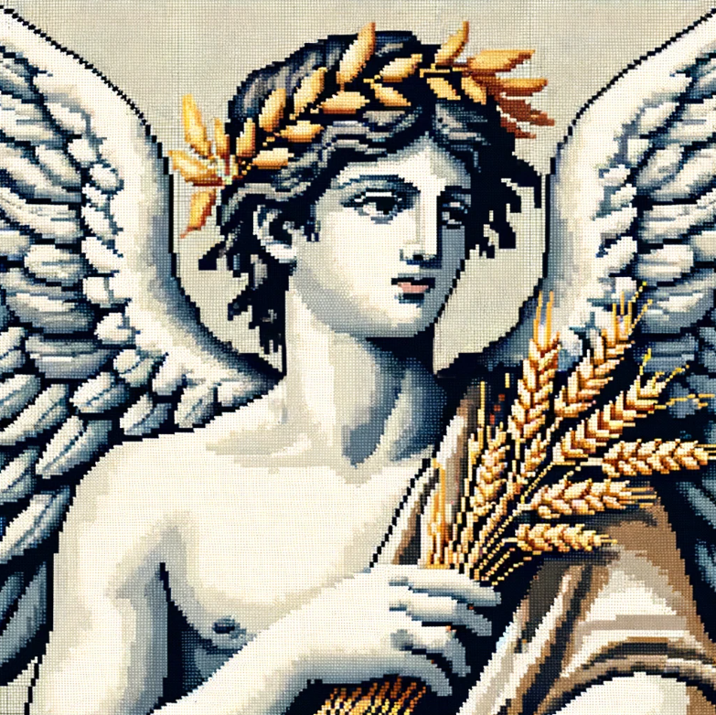
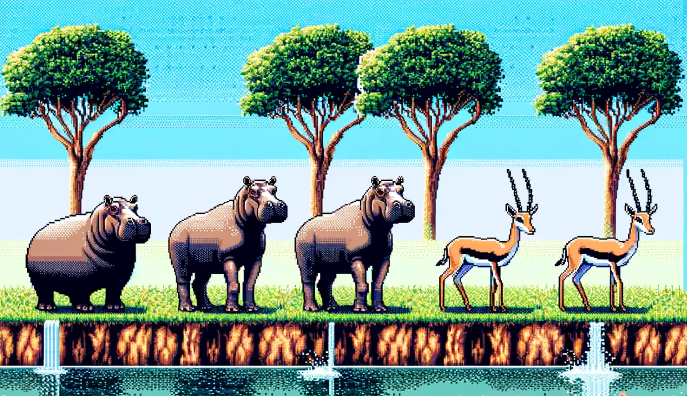
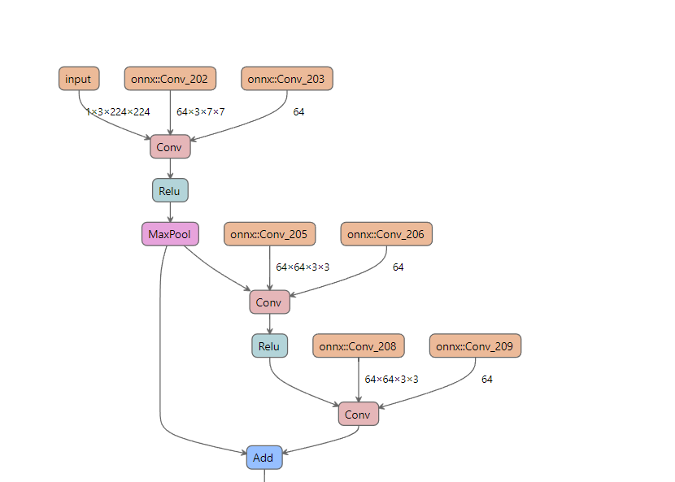
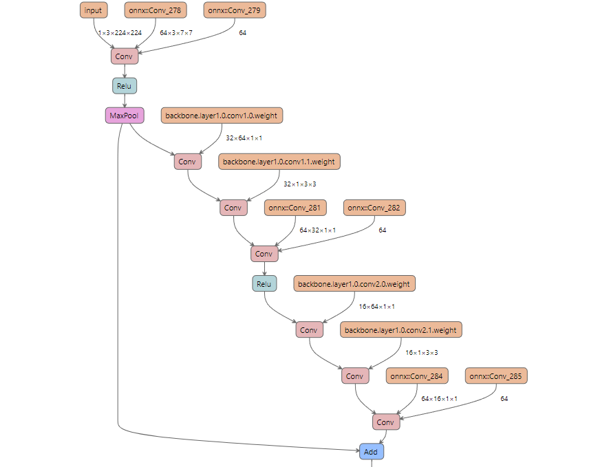
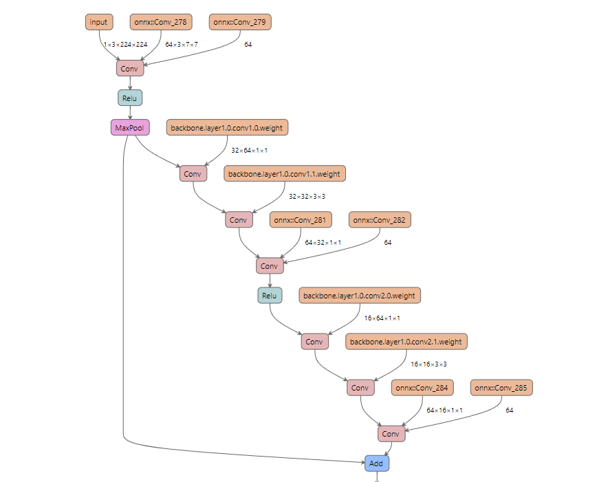
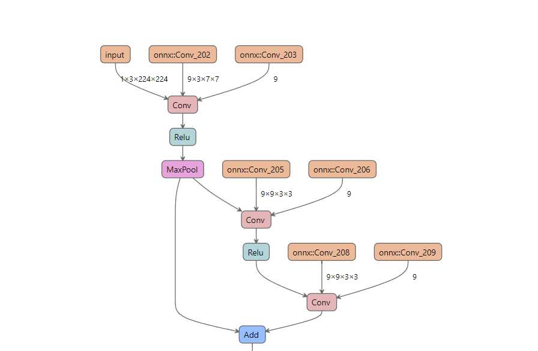
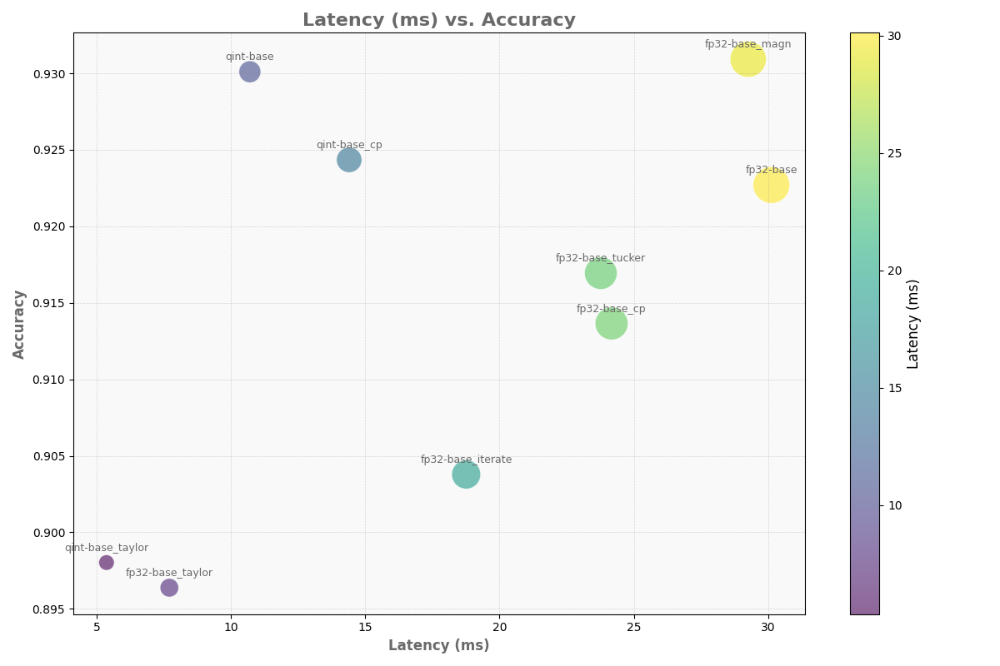
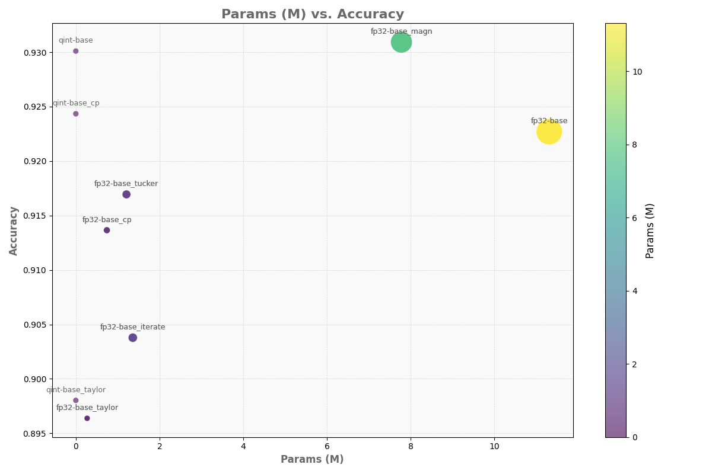

# URFU 2024 Master Thesis Source Code

This library assists UAVs (Unmanned Aerial Vehicles) in navigating and operating autonomously in challenging environments. It processes visual data on onboard devices to effectively detect and avoid obstacles.

## Key Features

### Neural Network Training

- **Training Neural Network Models for Obstacle Detection**
  - `train_base_model.py` — Training base FP32 model.

### Optimization Methods

- **Various Methods for Optimizing Neural Network Models**
  - `optimization/distillation_training.py` — Knowledge distillation training for small network models.
  - `optimization/layerwise_distillation.py` — Layerwise distillation training.
  - `optimization/low_rank_optimization.py` — Canonical and Tucker tensor decomposition of convolutional layers.
  - `optimization/pruning.py` — Magnitude and Taylor feature maps pruning.
  - `optimization/quantization.py` — Quantization-Aware Training (QAT) model training.

## Results

### Model Compression Using Tensor Decomposition

- **Base FP32 Model Compression**
  - Base FP32 Model: 
  - Canonical Decomposition: 
  - Tucker Decomposition: 

### Model Compression Using Feature Maps Pruning

- **Base FP32 Model with Taylor Pruning**
  - 

### Inference Performance Metrics

- **MMACS vs Accuracy**
  - 

- **Parameters (M) vs Accuracy**
  - 
